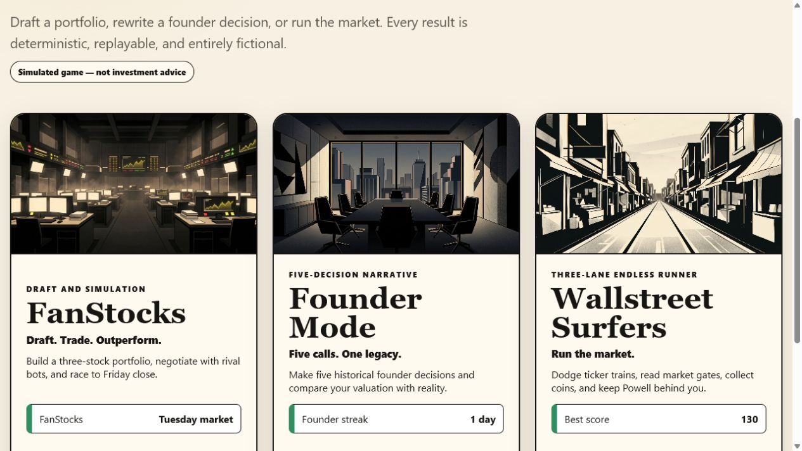
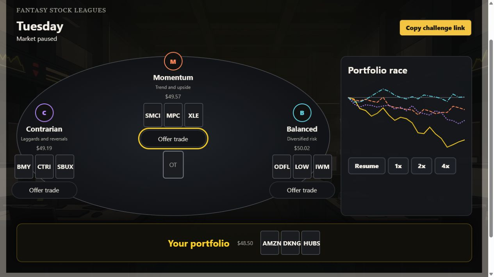
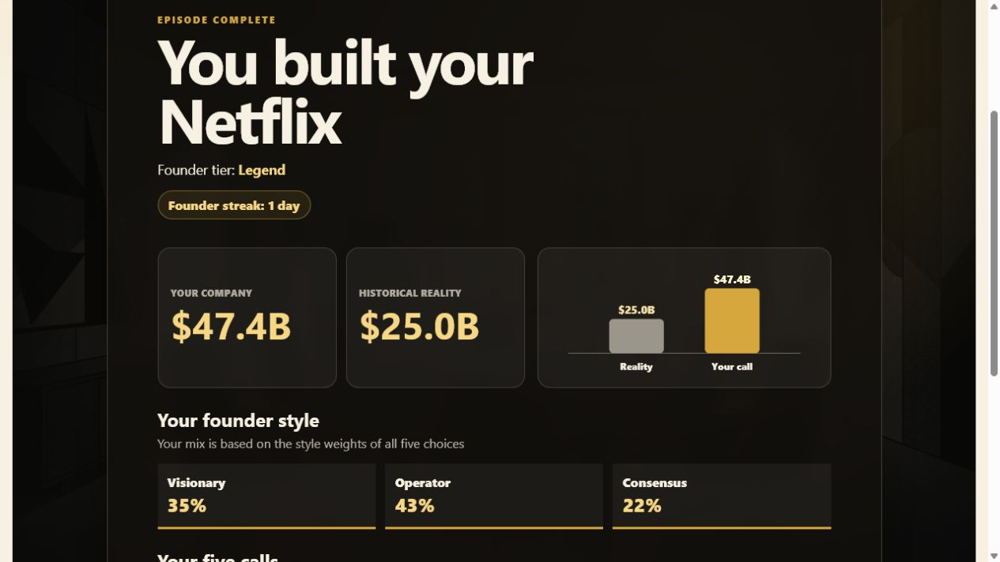
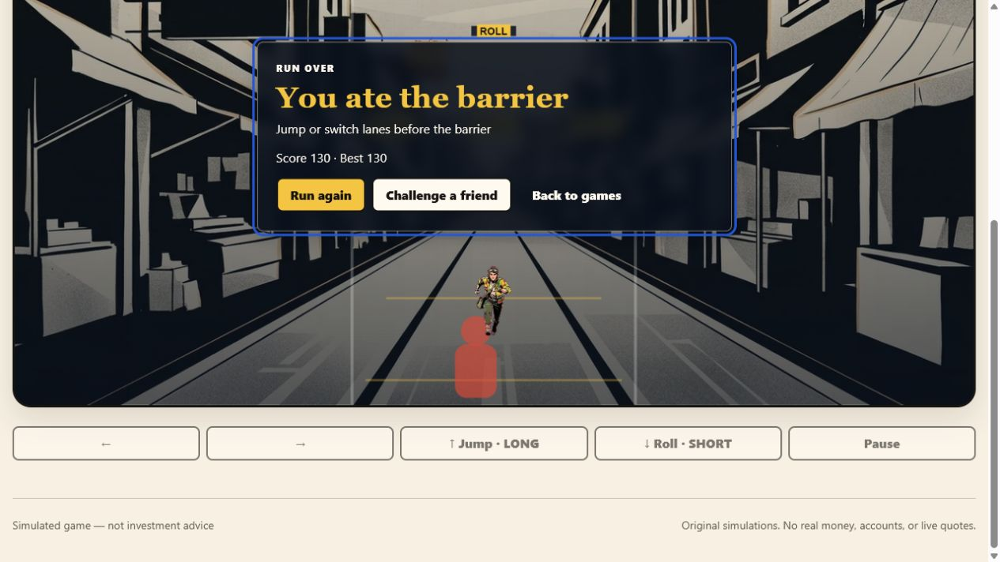

# OpenTrade

OpenTrade is a polished, offline-capable collection of three deterministic market games. It recreates the mechanics of the original OpenTrade experience with original Higgsfield-generated art and audio, stronger accessibility, resilient local saves, and responsive desktop/touch controls.

**[Play the live Vercel build](https://open-trade-seven.vercel.app)**

> Simulated game — not investment advice. No real money, accounts, or live quotes are used.



## Three complete games

### FanStocks

Draft one stock in each of three rounds, negotiate one-for-one trades with three rival strategies, and race four $50 portfolios through Friday close. The market is deterministic for a shared challenge seed and supports pause plus 1×, 2×, and 4× playback.



### Founder Mode

Take the chair for Netflix, Kodak, Apple, or Blockbuster. Make five linked historical decisions, see the effect of every call on company value, compare the result with reality, and receive a Founder tier and style breakdown. Classic and Brainrot modes change the writing without changing the simulation.



### Wallstreet Surfers

Run a deterministic three-lane course, collect coins, dodge typed hazards, and keep Powell behind you. Market gates turn LONG into Jump and SHORT into Roll. Keyboard, touch, swipe, and gamepad input are supported, with a guided first-run tutorial and shareable challenges.



## Run locally

OpenTrade requires Node.js 24.

```bash
npm ci
npm run dev -- --host 127.0.0.1
```

Then open [http://127.0.0.1:5173/Open-Trade/#/](http://127.0.0.1:5173/Open-Trade/#/).

Production commands:

```bash
npm run build          # GitHub Pages base: /Open-Trade/
npm run build:vercel   # Vercel base: /
npm run build:higgsfield # Portable relative-path build
```

## Verification

```bash
npm run check
npm run test:e2e
npm run test:deployment-smoke
```

The release gate includes ESLint, TypeScript, unit and browser-component tests, Playwright desktop/touch/cross-browser tests, media validation, audio decoding checks, asset-contract checks, service-worker injection, bundle budgets, and three deployment-shape smoke tests.

## Higgsfield asset provenance

The shipped experience uses ten accepted Higgsfield visuals and six accepted audio cues. The generated files live under `src/assets/generated/`; job receipts, model inputs, and outputs are retained under `design/higgsfield/jobs/`, with the acceptance record in `design/higgsfield/asset-review.csv`.

No generated asset depends on a remote runtime URL. Approved media is bundled, validated, and precached for offline play.

## Architecture

- React 19, TypeScript, Vite, and hash-based lazy game routes
- Phaser 3 for the Wallstreet Surfers renderer; deterministic simulation logic stays framework-independent
- Versioned, validated local saves with per-game recovery and hub progress summaries
- Shared audio, reduced-motion, accessible dialogs, semantic live status, and 44 px touch targets
- Installable PWA with fresh-document offline coverage and byte-range audio responses

Reverse-engineering evidence and the full failure/recovery trail are documented in [`docs/research/open-trade-reverse-engineering.md`](docs/research/open-trade-reverse-engineering.md).
